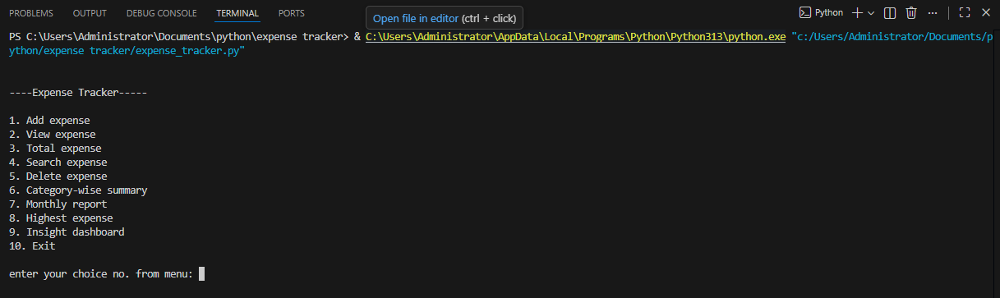
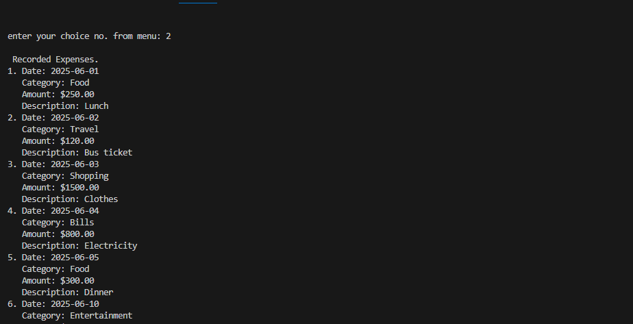
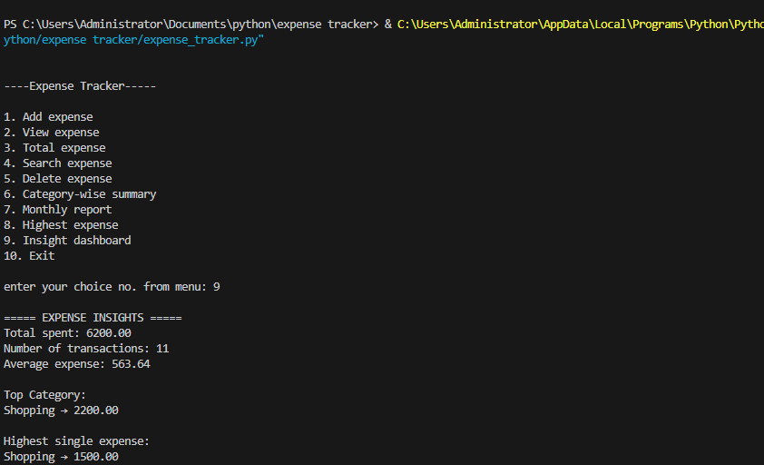

# 💰 Expense Tracker

A Python command-line application for managing personal expenses and generating spending insights. The project stores expense records in a CSV file and provides basic analytical reports using core Python.

---

## 🚀 Features

- Add new expenses
- View all recorded expenses
- Search expenses by category
- Delete expenses
- Calculate total expenses
- Save data to CSV file
- Load saved data automatically on startup

---

## 📊 Analytics & Insights

The project includes basic data analysis features:

- Category-wise spending summary
- Monthly expense reports
- Highest expense detection
- Total spending calculation
- Average expense calculation
- Number of transactions
- Top spending category

---

## 🛠️ Technologies Used

- Python
- CSV File Handling
- Lists and Dictionaries
- Functions
- Exception Handling

---

## 📂 Project Structure

```text
expense-tracker-python/
│
├── expense_tracker.py
├── expenses.csv
├── README.md
├── menu.png
├── expenses.png
└── insights.png
```

---

## ▶️ How to Run

1. Clone the repository:

```bash
git clone https://github.com/kritikasvishwakarma-ux/expense-tracker-python.git
```

2. Navigate to the project folder:

```bash
cd expense-tracker-python
```

3. Run the application:

```bash
python expense_tracker.py
```

---

## 📸 Screenshots

### Main Menu



### View Expenses



### Insights Dashboard



---

## 📈 Sample Insights Output

```text
===== EXPENSE INSIGHTS =====

Total spent: 6200.00
Number of transactions: 11
Average expense: 563.64

Top Category:
Shopping -> 2200.00

Highest single expense:
Shopping -> 1500.00
```

---

## 📚 What I Learned

Through this project, I practiced:

- Python fundamentals
- File handling using CSV files
- Working with lists and dictionaries
- Data aggregation and filtering
- Exception handling
- Building a complete CLI application
- Basic analytical thinking

---

## 🎯 Future Improvements

- Update/Edit expense records
- Export reports
- Data visualization using Matplotlib
- Streamlit web application
- Database integration

---

## 👨‍💻 Author

**Kritika Vishwakarma**

Aspiring Data Scientist | Python & SQL Learner
